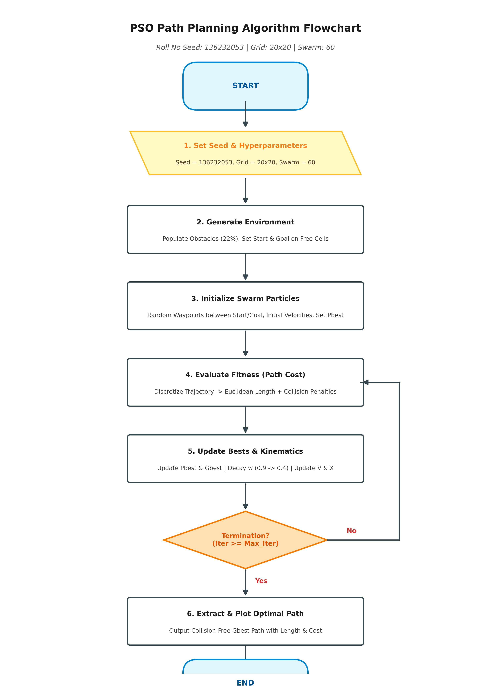
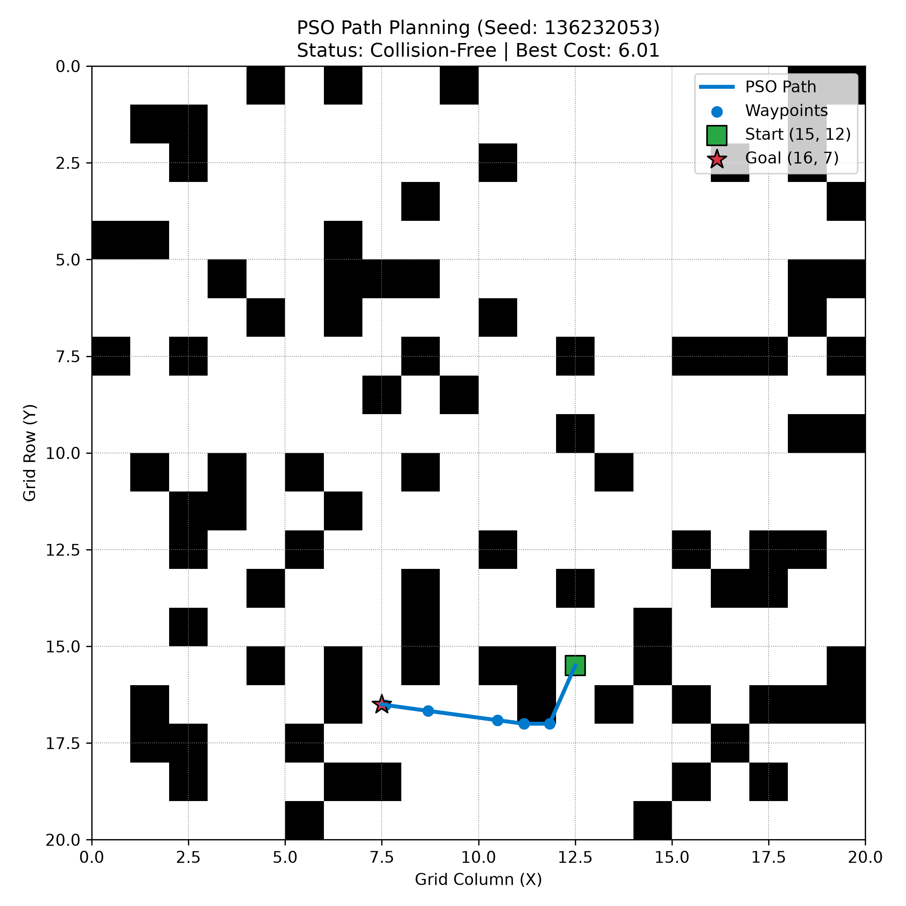

# Swarm-Based Path Planning with Obstacles (PSO)

## Student Information
- **Name:** Abdul Haseeb Khan
- **Roll Number:** 01-136232-053
- **Seed Used:** \136232053\

---

## 1. Approach Overview
This project implements Particle Swarm Optimization (PSO) to find an optimal, collision-free trajectory across a 2D grid containing obstacles.

- **Environment Generation:** A 20×20 grid populated with obstacles generated deterministically using seed \136232053\. Start \(15, 12)\ and Goal \(16, 7)\ points are placed strictly on unblocked cells.
- **Particle Representation:** Each particle controls 5 intermediate continuous 2D coordinates (waypoints) between the fixed Start and Goal locations.
- **Fitness Evaluation:** The fitness function penalizes paths proportional to their total Euclidean distance while imposing a heavy penalty (+500 per cell) for boundary violations or intersecting obstacle blocks.
- **PSO Dynamics:** Implements dynamic inertia weight decay (\{\max} = 0.9 \to w_{\min} = 0.4\$) alongside velocity clamping to ensure smooth convergence toward collision-free shortest paths.

---

## 2. Hand-Drawn Flow Diagram

---

## 3. How to Run

1. **Clone the repository:**
   \\\ash
   git clone https://github.com/Cheebakhan/swarm-pathplanning-01-136232-053.git
   cd swarm-pathplanning-01-136232-053
   \\\

2. **Install dependencies:**
   \\\ash
   pip install -r requirements.txt
   \\\

3. **Execute the optimization:**
   \\\ash
   python pso_path_planning.py
   \\\

---

## 4. Visualized Results

